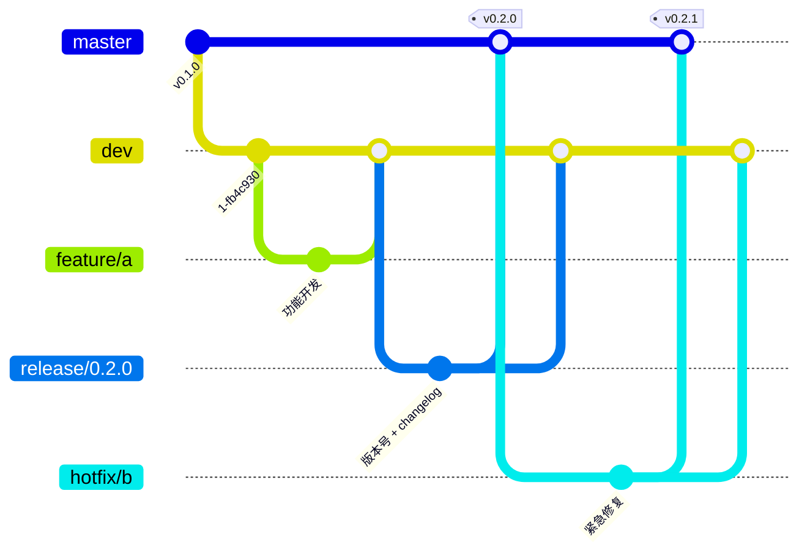

# passwd-x

跨平台密码管理 App（Tauri 2 + Rust 核心），当前处于早期开发阶段。

## 项目结构

- `core/` — 与平台无关的安全与业务逻辑（加密、保险库格式、数据模型）
- `app/` — Tauri 2 应用（后端 `src-tauri/`，前端 `ui/`）
- `docs/` — 架构、数据格式、功能任务清单与 AI 团队规范

## 开发命令

根目录为 Cargo workspace，Rust 命令统一在根目录运行：

- `cargo test --workspace`
- `cargo clippy --workspace --all-targets -- -D warnings`
- `cargo fmt --check`

前端与桌面应用命令在 `app/` 目录运行：

- `npm install`
- `npm run format` / `npm run format:check` — 前端格式化/校验（Prettier）
- `npm run tauri dev` — 本地运行桌面应用

Linux 桌面端需先安装 Tauri 的系统开发包（webkit2gtk-4.1、gtk-3、libsoup-3 等，见 `AGENTS.md`）。

提交前自动格式化：首次克隆后执行 `git config core.hooksPath .githooks`，之后每次提交自动运行 `cargo fmt` 与 Prettier。

## 开发流程

AI 团队以角色 skill 协作：产品经理维护待办，项目经理排期，系统架构师按 master-dev-release-hotfix 建分支并产出设计文档，开发与测试并行实现，PR 审核员把关合并。详见 `AGENTS.md` 与 `docs/team.md`。

- `master`：稳定生产分支，只接收 `release/*` 与 `hotfix/*`，合并时打 tag。
- `dev`：集成分支，`feature/*` 完成后合入这里。
- `feature/*`：功能分支，从 `dev` 拉出，完成后 PR 回 `dev`。
- `release/*`：发布分支，从 `dev` 拉出，完成后 PR 到 `master`（打 tag）再回并 `dev`。
- `hotfix/*`：热修复分支，从 `master` 拉出，完成后 PR 到 `master`（打 tag）再回并 `dev`。

## 版本与发布

版本号以根 `Cargo.toml` 的 `[workspace.package].version` 为唯一来源。系统运维每周三北京时间 10:00 通过 GitHub Actions 自动构建 release、更新 `CHANGELOG.md` 并上传到 GitHub Release（支持手动触发）。

详见 `AGENTS.md` 与 `docs/architecture.md`。
